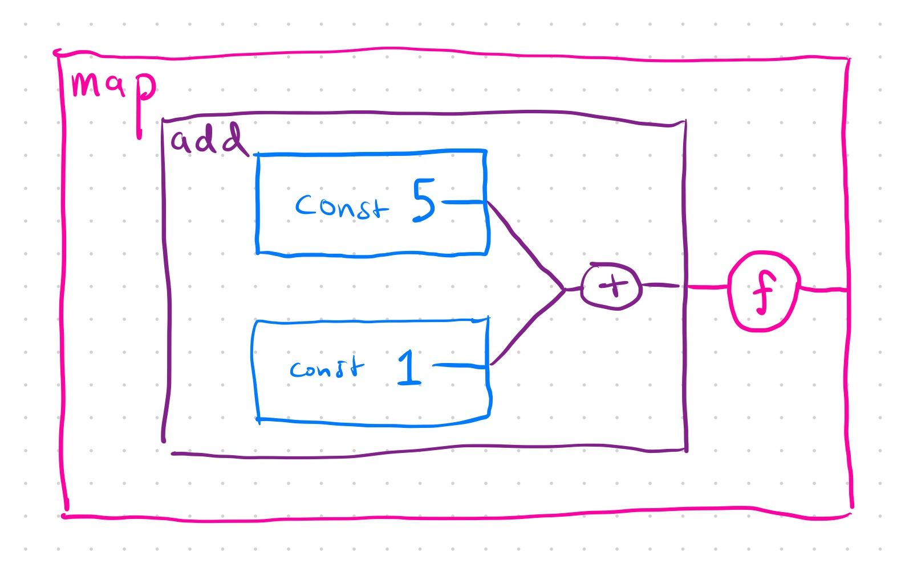
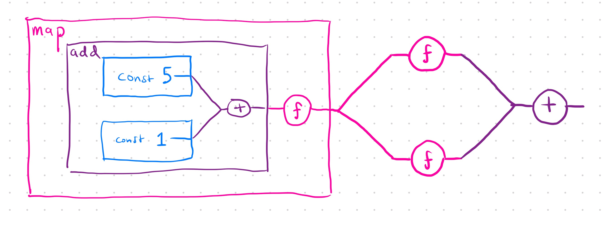
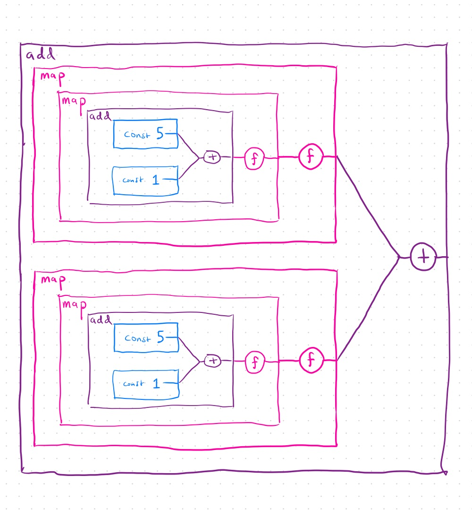
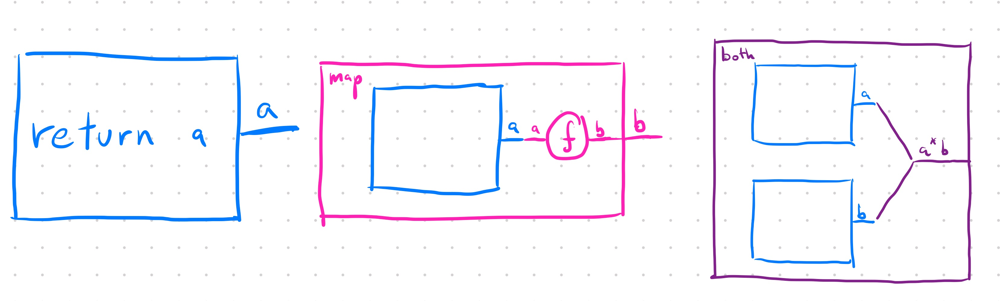
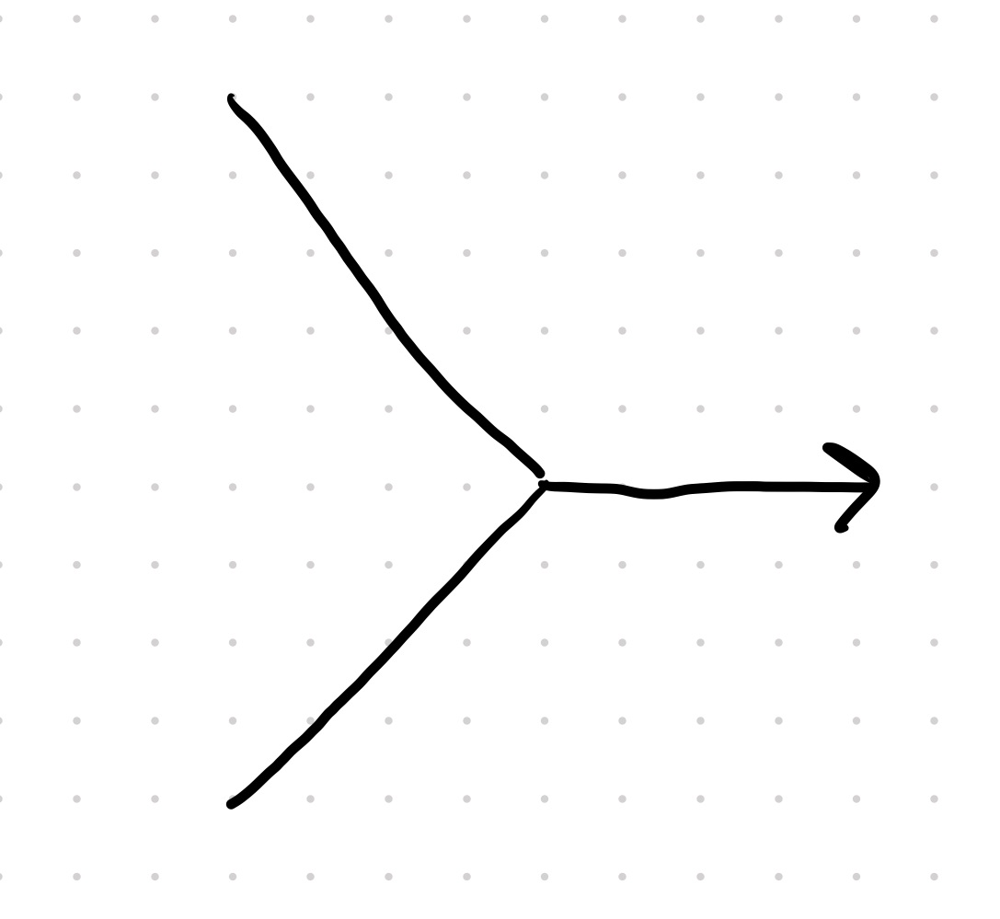
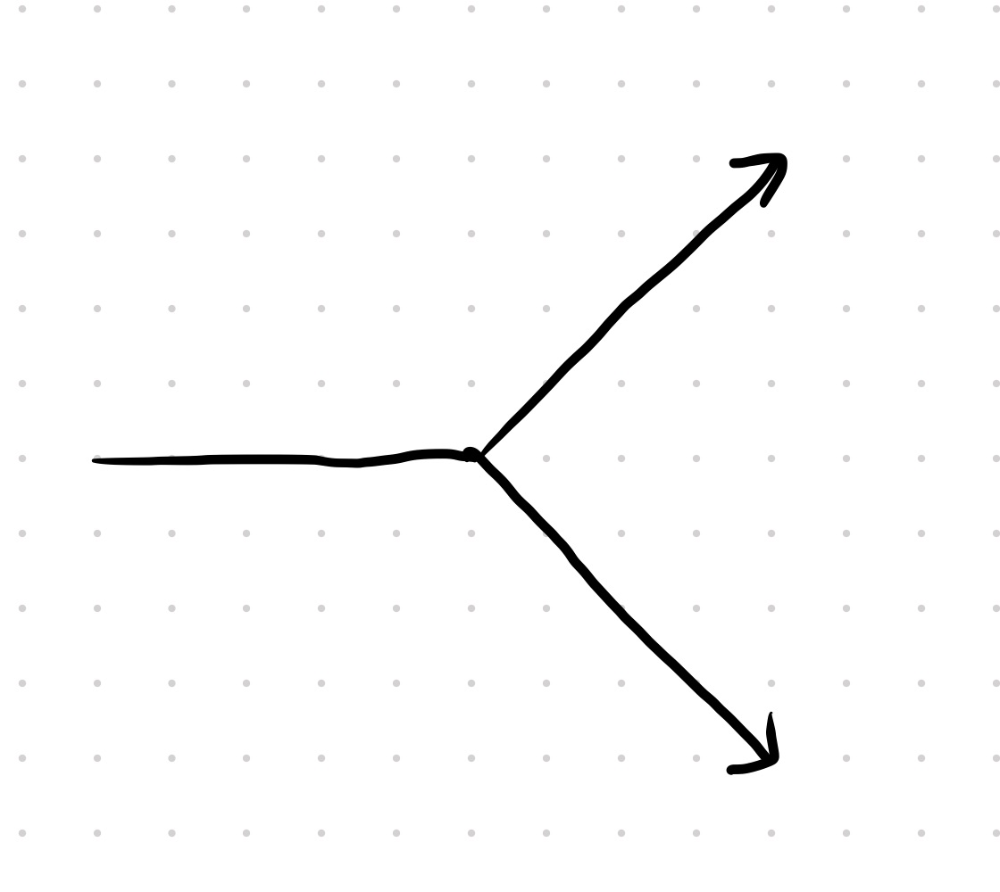
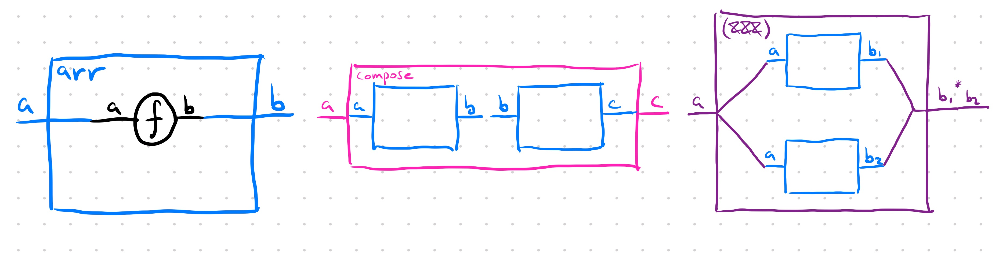

# I think I finally understand let%sub

<style>
img.medium {
  width: 450px;
}

img.small {
  width: 250px;
}
</style>

... and I want you to as well.

Although the goal of this post is to explain `let%sub` *in Bonsai*, I
think I'll do better by explaining the same idea in the context of a
much simpler example.

Let's say we're building a tiny little language for doing simple arithmetic:

<!-- $MDX file=./letsub/src/blog_letsub.ml,part=lang -->
```ocaml
type t =
  | Const of int
  | Add of t * t
  | Map of
      { t : t
      ; f : int -> int
      }

let const i = Const i
let add x y = Add (x, y)
let map t ~f = Map { t; f }

let rec eval : t -> int = function
  | Const i -> i
  | Add (x, y) -> eval x + eval y
  | Map { t; f } -> f (eval t)
;;
```

Now we use it to compute something like so:

<!-- $MDX file=./letsub/src/blog_letsub.ml,part=use1 -->
```ocaml
let print_and_return i =
  printf "got here\n";
  i
;;

let x = map (add (const 5) (const 1)) ~f:(fun i -> print_and_return (i / 2))
let doubled = map x ~f:(fun i -> i * 2)
let tripled = map x ~f:(fun i -> i * 3)
let y = add doubled tripled
let () = printf "y = %d\n" (eval y)
```

**Here's the question:** how many times does "got here" print?  Put
another way, how many times do we evaluate `x`?

I don't think anyone will be too surprised in this case that the
answer is two.  But still, let's break it down.  Let's first visualize
the computatation that `x` represents:



Each box represents a `t`.  We start with two `const` boxes that we
create from hard-coded ints.  We combine them using an `add`.
Finally, we map over that.

Now what do you think `y` looks like?  Does it look like this?



or this?



As much as you might *want* it to look like the first, it doesn't.  It
looks like the second.  If you use `x` twice, you're duplicating the
entire computation of `x`.  **There is no sharing.**

# How to add sharing

So how can we extend the language to enable us to share computation?
There's more than one way.

## Eager evaluation

The obvious way in our completely trivial language is to just eagerly
evaluate the ints as we construct them, but I claim that's cheating.
In Bonsai, often the values depend on user action and cannot, even in
principle, be eagerly computed.  So what other options do we have?

## Mutability

To me, this feels a lot like trying to improve the performance of the
following function

```ocaml
let rec fib n =
  match n with
  | 0 | 1 -> n
  | n -> fib (n - 1) + fib (n - 2)
```

This function suffers the same problem as `y` - we recompute the exact
same values over and over again.  How do we solve the problem?
Memoization!  We cache previously computed values so that if we're
asked to compute the same thing again, we just return the cached value.

Let's apply this idea to our language.  A lot of this is repeat.  The
interesting change is that we add a new function `cache` which takes a
`t` and returns a new `t` that's really just a mutable version of that
`t`.  The mutability allows us to replace the unevaluated `t` with an
evaluated int the first time we compute it.

<!-- $MDX file=./letsub/src/blog_letsub.ml,part=cache -->
```ocaml
  type t =
    | Const of int
    | Add of t * t
    | Map of
        { t : t
        ; f : int -> int
        }
    | Cached of { mutable value : [ `Not_yet_evaluated of t | `Evaluated of int ] }

  let const i = Const i
  let add x y = Add (x, y)
  let map t ~f = Map { t; f }
  let cache t = Cached { value = `Not_yet_evaluated t }

  let eval t =
    let rec eval = function
      | Const i -> i
      | Add (x, y) -> eval x + eval y
      | Map { t; f } -> f (eval t)
      | Cached cached_value ->
        (match cached_value.value with
         | `Evaluated i -> i
         | `Not_yet_evaluated t ->
           let i = eval t in
           cached_value.value <- `Evaluated i;
           i)
    in
    eval t
  ;;
```

And here's a test that shows that by caching `x` we now only print
"got here" once, even though we mapped on `x` twice:

<!-- $MDX file=./letsub/src/blog_letsub.ml,part=cache-test -->
```ocaml
  let%expect_test "" =
    let x = map (add (const 5) (const 1)) ~f:(fun i -> print_and_return (i / 2)) in
    let x = cache x in
    let doubled = map x ~f:(fun i -> i * 2) in
    let tripled = map x ~f:(fun i -> i * 3) in
    let y = add doubled tripled in
    printf "y = %d\n" (eval y);
    [%expect {|
      got here
      y = 15 |}]
  ;;
```

### By the way, this is how deferred and incremental work

In the first section, I claimed that `map` does not share work.  If
you map on a thing twice, you compute it twice.

This may have come as a pretty big surprise to you (it did for me)
because I'm accustomed to using things that absolutely do not work
that way.  Incremental is one case, but the more common case is
deferred.  Consider the following snipped of code:

```ocaml skip
let x : unit Deferred.t = Clock.after (sec 1.) >>| fun () -> print_endline "x" in
let y = x >>| fun () -> print_endline "y" in
let z = x >>| fun () -> print_endline "z" in
let%map () = Deferred.all_unit [x;y;z] in
```

Will "x" get printed once or twice?  Once!  So wait... we mapped on a
thing twice and it got computed once.  What gives?

Deferred uses mutability - like our `Cached` variant - to share
computation between multiple maps.  So let me revise my claims from
above: *without mutability* `map` does not share work.

For example, haskell has no mutability and therefore "x" will
definitely print twice in the following code:
```
main :: IO ()
main = do
  let x = print "x"
      y = x >> print "y"
      z = x >> print "z"
  y
  z
```

## Sub

Bonsai doesn't use mutability to achieve sharing - it uses `sub`.  How
does that work?  To see, let's add `sub` to our language:

<!-- $MDX file=./letsub/src/blog_letsub.ml,part=bonsai1 -->
```ocaml
  module Uid = Unique_id.Int ()

  type t =
    | Const of int
    | Precomputed_value of Uid.t
    | Add of t * t
    | Map of
        { t : t
        ; f : int -> int
        }
    | Sub of
        { thing_to_precompute : t
        ; name : Uid.t
        ; body_that_uses_precomputed_thing : t
        }

  let const i = Const i
  let add x y = Add (x, y)
  let map t ~f = Map { t; f }

  let sub t ~f =
    let name = Uid.create () in
    Sub
      { thing_to_precompute = t
      ; name
      ; body_that_uses_precomputed_thing = f (Precomputed_value name)
      }
  ;;

  let eval t =
    let rec eval ~scope = function
      | Const i -> i
      | Precomputed_value name -> Map.find_exn scope name
      | Add (x, y) -> eval ~scope x + eval ~scope y
      | Map { t; f } -> f (eval ~scope t)
      | Sub { thing_to_precompute; name; body_that_uses_precomputed_thing } ->
        let i = eval ~scope thing_to_precompute in
        let scope = Map.set scope ~key:name ~data:i in
        eval ~scope body_that_uses_precomputed_thing
    in
    eval ~scope:Uid.Map.empty t
  ;;

  let%expect_test "" =
    let x = map (add (const 5) (const 1)) ~f:(fun i -> print_and_return (i / 2)) in
    let y =
      sub x ~f:(fun x ->
        let doubled = map x ~f:(fun i -> i * 2) in
        let tripled = map x ~f:(fun i -> i * 3) in
        add doubled tripled)
    in
    printf "y = %d\n" (eval y);
    [%expect {|
      got here
      y = 15 |}]
  ;;
```

How does `sub` work?  It takes an expression `thing_to_precompute` and
a function which wants to use that expression while only evaluating it
once.  The trick is that instead of passing `thing_to_precompute`
directly to the function, it instead mints a unique name for that expression
and passes `(Precomputed_value name)` to `f`.

Later when evaluating the `sub` expression, we evaluate
`thing_to_precompute` once and then store the evaluated int in a
map called `scope`, using the key `name`.  Then we evaluate the body
which, remember, doesn't refer directly to `thing_to_precompute` but
instead on `Precomputed_value name`.  Every time the body needs to find the
value of `thing_to_precompute`, it just looks up the value for `name`
in `scope`.

QED!

### A bit of polishing

From a conceptual standpoint, the previous section really does explain
how `sub` works.  But you might still wonder why Bonsai has such an
unusual signature for `sub`:

```ocaml skip
    val sub
      :  'a Computation.t
      -> f:('a Value.t -> 'b Computation.t)
      -> 'b Computation.t
```

Why do we need these two types?  The real answer is we don't *need*
them, but it makes things a little cleaner.

Notice that in the last version of our language (the one with sub),
the `f` in `sub t ~f` always gets a version of `t` that is constructed
via the `Precomputed_value of Uid.t` constructor.  Can we encode that fact in the
types?

Sure - let's give that case its own type:

<!-- $MDX file=./letsub/src/blog_letsub.ml,part=bonsai2 -->
```ocaml
  type precomputed_value = Uid.t

  type t =
    | Const of int
    | Add of t * t
    | Arr of
        { value : precomputed_value
        ; f : int -> int
        }
    | Sub of
        { bound : t
        ; name : Uid.t
        ; body : t
        }

  let const i = Const i
  let add x y = Add (x, y)
  let arr value ~f = Arr { value; f }

  let sub t ~f =
    let name = Uid.create () in
    Sub { bound = t; name; body = f name }
  ;;
```

Now what's the type of sub?

```ocaml skip
val sub : t -> f:(value -> t) -> t
```

Huh... that's starting to look a lot like Bonsai's version of sub.
And if you want to see what `eval` looks like now, it's really not
very different:

<!-- $MDX file=./letsub/src/blog_letsub.ml,part=eval2 -->
```ocaml
  let eval t =
    let rec eval ~scope = function
      | Const i -> i
      | Add (x, y) -> eval ~scope x + eval ~scope y
      | Arr { value; f } ->
        let i = Map.find_exn scope value in
        f i
      | Sub { bound; name; body } ->
        let i = eval ~scope bound in
        let scope = Map.set scope ~key:name ~data:i in
        eval ~scope body
    in
    eval ~scope:Uid.Map.empty t
  ;;
```

You might notice that I snuck in one last change, which is that I
removed `map` completely and replaced it with `arr`.  The important
difference is that `map` mapped over a `t` whereas `arr` maps over a
`precomputed_value`.  What does that mean from a practical
perspective?  It means that `arr` is only allowed to map over
precomputed values.  In other words, mapping over a non-precomputed
thing twice won't even compile.  If you want to map, first `sub` to
get a precomputed `precomputed_value` and then `arr` to map over that.

Here it is in action:

<!-- $MDX file=./letsub/src/blog_letsub.ml,part=test2 -->
```ocaml
  let%expect_test "" =
    let x =
      sub
        (add (const 5) (const 1))
        ~f:(fun sum -> arr sum ~f:(fun i -> print_and_return (i / 2)))
    in
    let y =
      sub x ~f:(fun x ->
        let doubled = arr x ~f:(fun i -> i * 2) in
        let tripled = arr x ~f:(fun i -> i * 3) in
        add doubled tripled)
    in
    printf "y = %d\n" (eval y);
    [%expect {|
      got here
      y = 15 |}]
  ;;
```

### Why does Bonsai have map then?

If `map` let's you do "a bad thing", why does Bonsai have it?
Historical accident. If Bonsai devs could remove it, they would.

## Applicatives vs. Arrows

If the above was just way to easy to understand, I can make it a bit
more abstract for you. Everything we've talked about so far is
essentially a case study in understanding applicatives vs. arrows.

An applicative is something that satisfies this interface:

<!-- $MDX file=./letsub/src/blog_letsub.ml,part=applicative -->
```ocaml
module type Applicative = sig
  type 'a t

  val return : 'a -> 'a t
  val map : 'a t -> f:('a -> 'b) -> 'b t
  val both : 'a t -> 'b t -> ('a * 'b) t
end
```

or in picture form:



Note: this isn't the typical way to describe an applicative but it's
equivalent to the typical version and it's way easier to
understand. Our simple arithmetic language is actually an applicative
in disguise with `const` and `add` serving as `return` and `both`.

What types of computation graphs can you represent with an
applicative?  They key is to realize that two branches can be combined
via `both` but a single branch can never split back into two parallel
branches.

In other words, assuming your graph is connected left to right, you
can see a shape that looks something like this:



but never this:



But the latter shape is often what we want!  In particular, when we
want to compute a single value and reuse it in two different later
computations (without necessarily using mutability).

This ability to share a value with two later computations is
exactly what arrow gives you on top of applicative.

<!-- $MDX file=./letsub/src/blog_letsub.ml,part=arrow -->
```ocaml
module type Arrow = sig
  type ('a, 'b) t

  val arr : ('a -> 'b) -> ('a, 'b) t

  (* Combine two arrows in series *)
  val compose : ('a, 'b) t -> ('b, 'c) t -> ('a, 'c) t

  (* Combine two arrows in parallel *)
  val ( &&& ) : ('a, 'b1) t -> ('a, 'b2) t -> ('a, 'b1 * 'b2) t
end
```



If you're willing to squint past the fact that an arrow type has two
type parameters and the oh-so-descriptive name of `&&&`, you can see
that `&&&` gives us the exact shape that we were missing.  It lets us
compute some value `'a` and then pass it to two later computations, in
effect **sharing the value of `'a`**.

It's no coincidence that Bonsai *is an arrow*.  It might not expose an
interface that looks like `module type Arrow`, but it's actually
equivalent to that interface.  The key is realizing that the following
type definitions is the right one:

```ocaml skip
type ('a, 'b) t = 'a Value.t -> 'b Computation.t
```

Using that as your primary arrow type, it's not hard to define `arr`,
`compose`, and `(&&&)` using Bonsai's `let%sub` and `let%arr`:

<!-- $MDX file=./letsub/src/blog_letsub.ml,part=create_arrow -->
```ocaml
module Arrow_from_bonsai : sig
  type ('a, 'b) t = 'a Value.t -> 'b Computation.t

  val arr : ('a -> 'b) -> ('a, 'b) t
  val compose : ('a, 'b) t -> ('b, 'c) t -> ('a, 'c) t
  val ( &&& ) : ('a, 'b1) t -> ('a, 'b2) t -> ('a, 'b1 * 'b2) t
end = struct
  type ('a, 'b) t = 'a Value.t -> 'b Computation.t

  let arr f value =
    let%arr value = value in
    f value
  ;;

  let compose t1 t2 value =
    let%sub result = t1 value in
    t2 result
  ;;

  let ( &&& ) t1 t2 value =
    let%sub result1 = t1 value in
    let%sub result2 = t2 value in
    let%arr result1 = result1
    and result2 = result2 in
    result1, result2
  ;;
end
```

## tl;dr: Can you summarize?

Sure, here are my main takeaways:

- `let%sub` enables sharing.  You can compute a value once and use it in
  multiple sub-computations.

- Avoid `let%map`. If you limit yourself to only using `let%sub` and
  `let%arr` you won't be able to accidentally duplicate work.

- Thinking of `type ('a, 'b) t = 'a Value.t -> 'b Computation.t` as
  the "real" bonsai type (in some sense) was a huge conceptual
  simplification for me.  For some reason, wrapping my head around
  what a `Value` *is* and what a `Computation` *is* was quite hard.
  However, it's immediately obvious how values of `type ('a, 'b) t`
  can be composed into arbitrarily large and complicated graphs, and
  being able to visualize the graph makes it more clear what I'm
  doing.  That said, actually operating on that type is awkward for
  reasons outlined [in this post](./proc.md), which is why we have
  `Value` and `Computation`.
